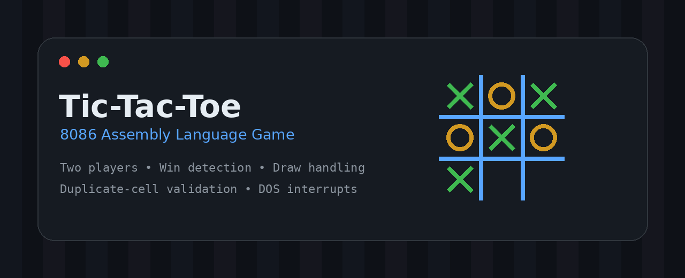
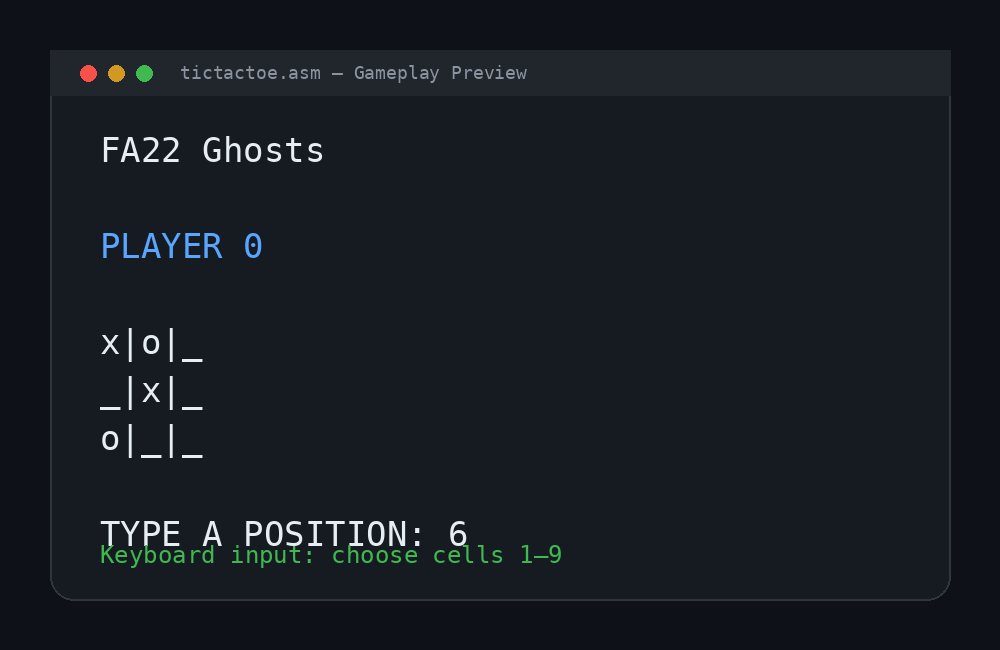
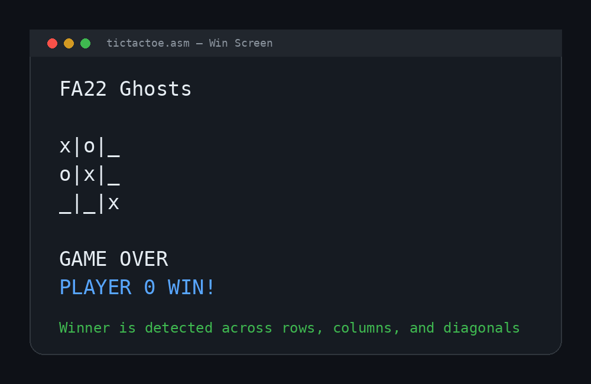
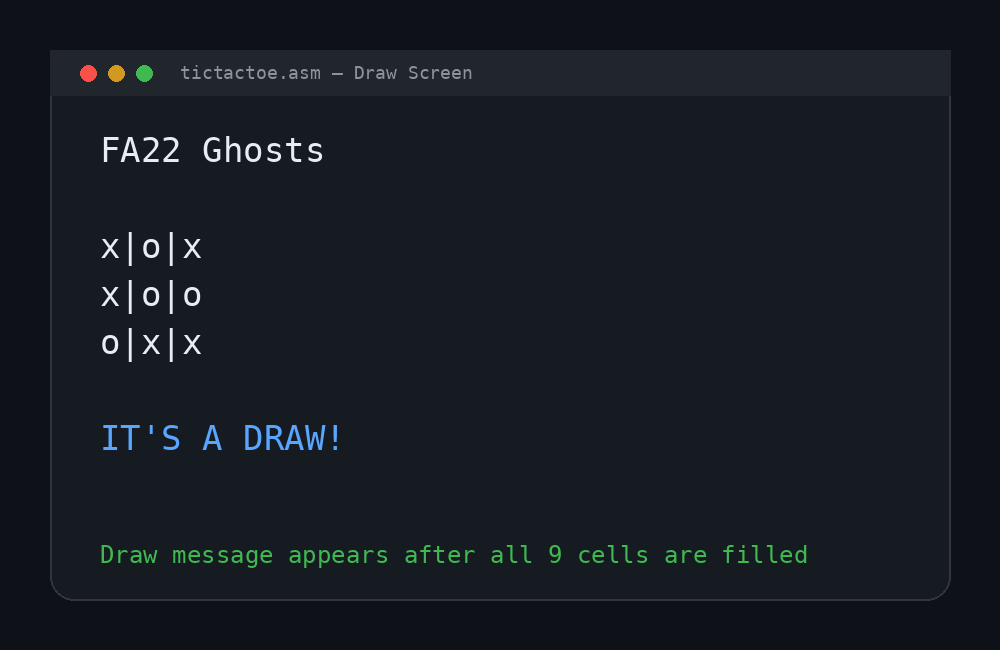

# Tic-Tac-Toe Game in 8086 Assembly



A simple two-player **Tic-Tac-Toe** game built in **8086 Assembly Language**. The game runs in a DOS/EMU8086-style environment and lets two players take turns, place marks on the board, detect wins, handle draws, and prevent moves on already-filled cells.

## Screenshots

### Gameplay Preview


### Winning Screen


### Draw Screen


## Features

- Two-player turn-based gameplay.
- Board display updated after every valid move.
- Win detection for rows, columns, and diagonals.
- Draw detection after all 9 cells are filled.
- Prevents players from selecting an already-used cell.
- Uses keyboard input and DOS interrupts for console interaction.

## How to Play

The board positions are mapped from **1 to 9**:

```text
1 | 2 | 3
4 | 5 | 6
7 | 8 | 9
```

1. Run the program in an 8086/DOS-compatible assembler or emulator.
2. The current player is displayed on the screen.
3. Type a position number from `1` to `9`.
4. The game updates the board and switches turns.
5. The game ends when a player wins or when the board is full.

## How to Run

### Option 1: EMU8086

1. Open `tictactoe.asm` in EMU8086.
2. Compile the file.
3. Run the program.
4. Enter board positions using the keyboard.

### Option 2: DOSBox with MASM/TASM

Use an 8086-compatible assembler such as MASM or TASM inside DOSBox, then assemble, link, and run the generated executable.

Example flow:

```bat
asm tictactoe.asm
link tictactoe.obj
tictactoe.exe
```

> Command names may vary depending on the assembler you use.

## Project Structure

```text
.
├── tictactoe.asm
├── README.md
└── assets/
    ├── banner.png
    ├── gameplay-preview.png
    ├── win-screen.png
    └── draw-screen.png
```

## Main Concepts Used

- Data, stack, extra, and code segments.
- Keyboard input using DOS interrupt `int 21h`.
- Screen clearing using BIOS interrupt `int 10h`.
- Board position tracking through pointers.
- Conditional jumps for game logic.
- Procedures for player switching, board updating, win checking, and draw checking.

## Project Title

**Tic-Tac-Toe Game in Assembly Language**

## Short Description

A simple two-player Tic-Tac-Toe game built in 8086 Assembly that lets players take turns, updates the board, checks for wins, handles draws, and prevents choosing already-filled cells.

## License

This project is open for learning and academic use. Add your preferred license before publishing the repository.
